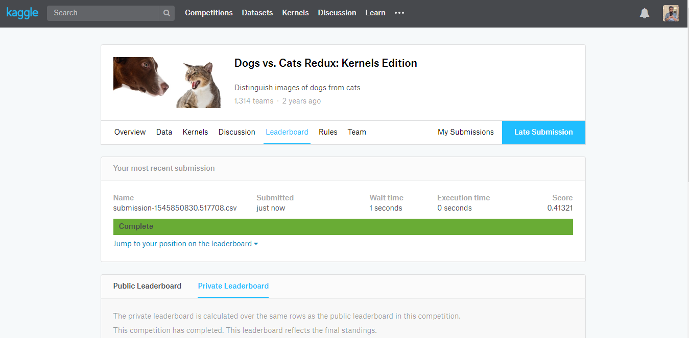

# Dogs vs Cats Kaggle 

Dogs vs Cats classification for kaggle competition. Check out the contest [here](https://www.kaggle.com/c/dogs-vs-cats-redux-kernels-edition)

## Installation
Follow the steps to get this project up and running.

  - Clone this project
    ```
    git clone https://github.com/Jeetu95/Dogs-Vs-Cats-Kaggle.git
    ```
  - Then install the required packages.
    ```
    pip install -r requirements.txt
    ```
  - download the data from the contest link given above and unpack it inside data folder.
    ```
    data\train
    data\test
    ```
  - now start the jupyter notebook and you are good to go.

## Result
Loading the saved model in the saved_models folder gave me this result.
  


## License
This project is under MIT License check it [here](LICENSE)
